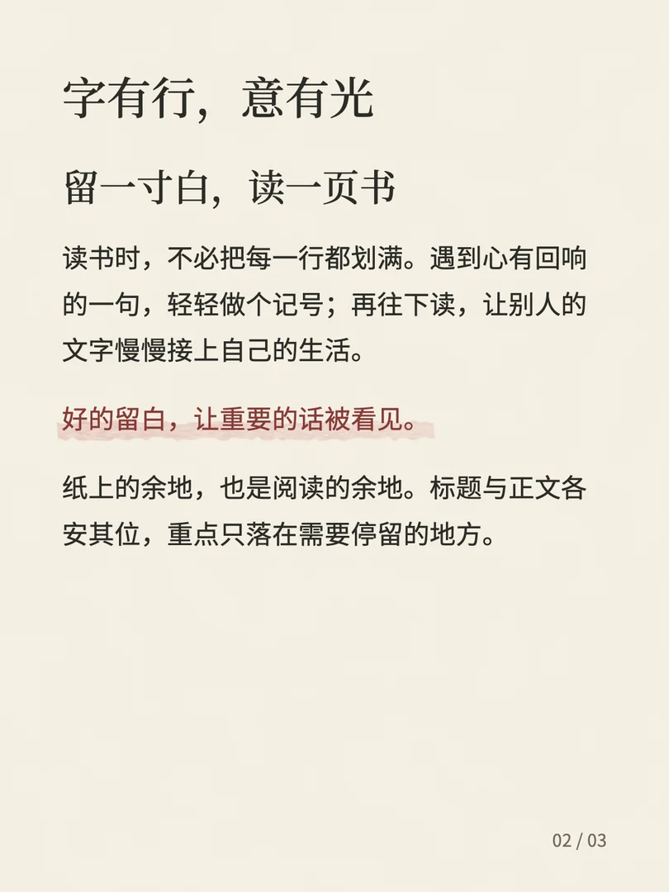
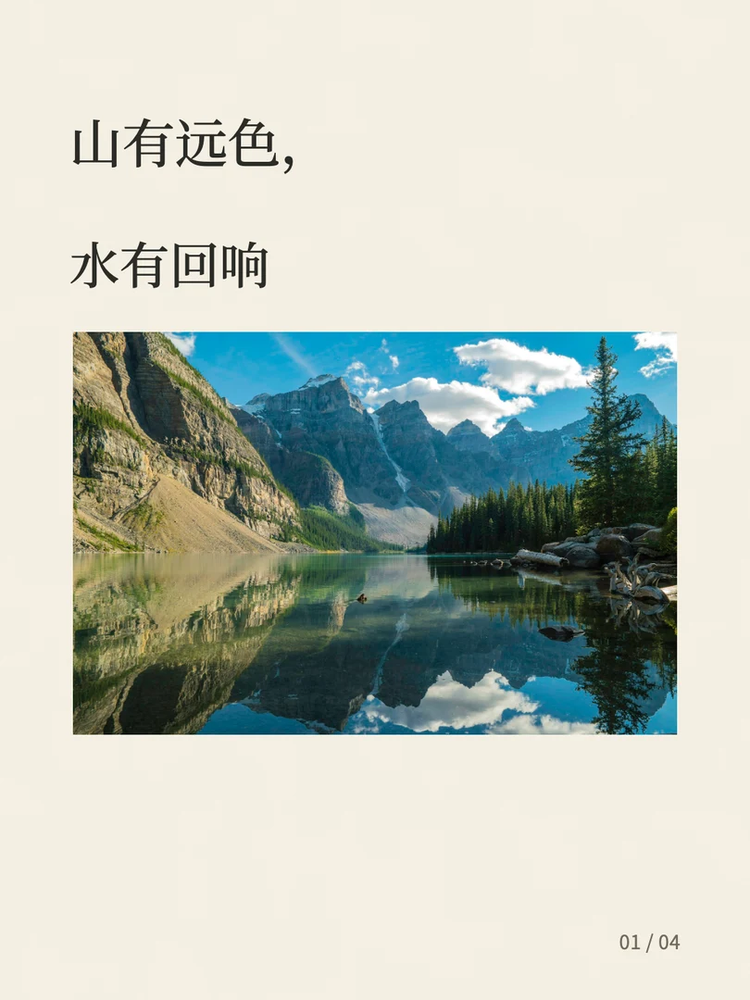

# 红笺 · Redleaf

**字有行，意有光。**

把 Markdown 排成有纸感的中文图文。暖书纸、墨字、贴近字脚的淡染批注；保留原文，让长文在手机上从容展开。

 

## 安装

通过 [Skills CLI](https://github.com/vercel-labs/skills) 安装，选择你所用的 Agent：

```sh
npx skills add blainehuang1028/redleaf-skill --skill redleaf
```

默认安装到当前项目。加 `-g` 可全局安装，加 `-a codex` 可指定 Codex。若需固定版本：

```sh
npx skills add https://github.com/blainehuang1028/redleaf-skill/tree/v0.1.0/skills/redleaf
```

也可下载 [技能 ZIP](https://github.com/blainehuang1028/redleaf-skill/releases/latest/download/redleaf-skill.zip)，将 `redleaf` 文件夹放入 Agent 的 skills 目录。入口为 [SKILL.md](skills/redleaf/SKILL.md)。不需要连接社交账号。

## 使用

安装后，把这句话和原稿交给 Agent：

> 请用红笺排版这份 Markdown，保留原文，使用朱砂主题，导出 3:4 图片和预览。

首次使用需 Node.js 22+。Agent 可按技能说明准备运行依赖；也可以在安装后的 `redleaf` 目录手动运行：

```sh
npm ci
npm run fonts
npx playwright install chromium
node scripts/render.mjs examples/article.md --out ./my-first-redleaf
```

字体从固定源提交下载并校验 SHA256，初次准备后，使用本地图片的文章可离线渲染。输出目录必须是新目录。

## 一篇原稿，一叠红笺

- **原句原意，妥帖安放。** 保留文字顺序、链接、原图，代码保留空格与换行。
- **五色入笺，各得其宜。** 朱砂、苍蓝、苍绿、赭石、藤黄；每册采用统一主题。
- **长文接页，长图续景。** 段落、嵌套列表、表格与代码自动分页；独立长截图按比例分段，保留完整原图。
- **此刻成图，来日可续。** 输出 1080×1440 编号 PNG、响应式预览、文字 HTML、原始 Markdown、原图、配置、素材清单与 QA。

红笺不自动加品牌或 AI 水印。纸纹与笔触均在本地绘制；页脚默认仅有页码，也可指定作者。图片内原有标记会照原样保留。

数学公式与 Mermaid 暂不自动执行，Raw HTML 安全显示为文字。不能排下的单行表格会停止并提示调整，不会生成截断成品。无图时不代造配图，没有原文结语时不补结语。

## 排版系统

- [排版规范](skills/redleaf/references/design-system.md)：字体、留白、纸面、笔触与内容路由。
- [色彩规范](skills/redleaf/references/color-system.md)：颜料、文字与淡染。
- [设计参数](skills/redleaf/assets/tokens.json)：生成 CSS 的统一值源。
- [系统样张](skills/redleaf/examples/system/index.html)：可切换主题，含封面、正文、引用、步骤、表格、长提示词与配图。
- [运行参考](skills/redleaf/references/rendering.md)：封面、图片、手动分页、局部笔触与离线重排。
- [官网源文件](website/index.html)：真实导出样张、安装与使用指南；可独立作为静态网站部署。

## 开发与验证

```sh
cd skills/redleaf
npm ci
npm run fonts
npx playwright install chromium
cd ../..
node tests/regression.mjs output/release
node scripts/package.mjs
```

回归覆盖五主题、长文、真实图片、嵌套编号、带链接长截图、标题与配图、空稿拒绝与并发字体安装。测试需要新的输出目录。官网资产构建与部署说明见 [website/README.md](website/README.md)。

编辑 `assets/tokens.json` 后，在 skill 目录运行 `node scripts/build-tokens.mjs`。自动检查不替代视觉验收，请查看手机宽度与原尺寸 PNG。

## 许可与来源

独立代码采用 [MIT](LICENSE) 许可。思源宋体、思源黑体、Noto Sans Mono 采用随附 SIL OFL 1.1。

产品哲学受 [Kami / tw93](https://kami.tw93.fun/index-zh.html) 启发，红笺独立实现图文分页与纸墨笔触。颜色参考[中国色](https://zhongguose.com/)与[东方色](https://www.2kil.com/)，是数字参考，不宣称历史唯一标准。

摄影演示使用 [Mark Koch / Unsplash](https://unsplash.com/photos/river-near-mountains-KiRlN3jjVNU) 的许可照片。详见 [素材记录](tests/fixtures/SOURCES.json)及[来源与复用范围](skills/redleaf/references/sources.md)。
