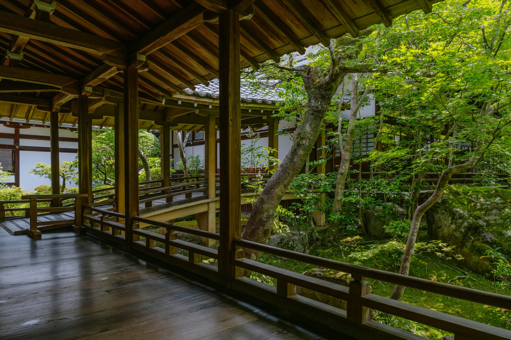
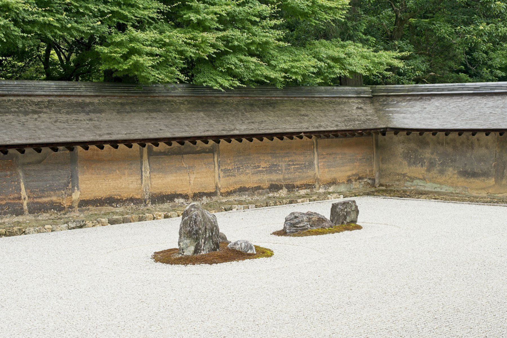
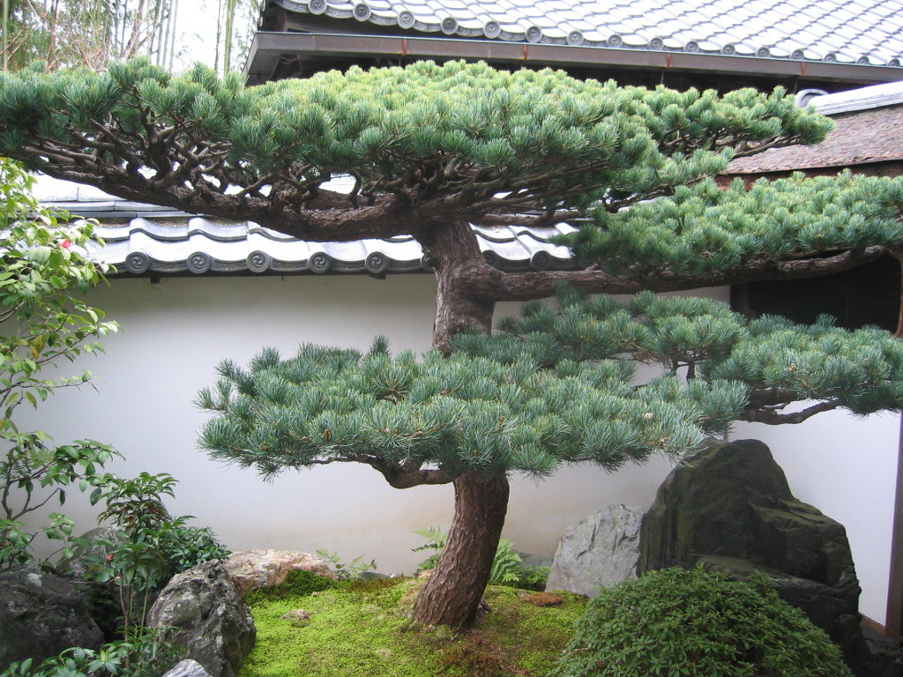
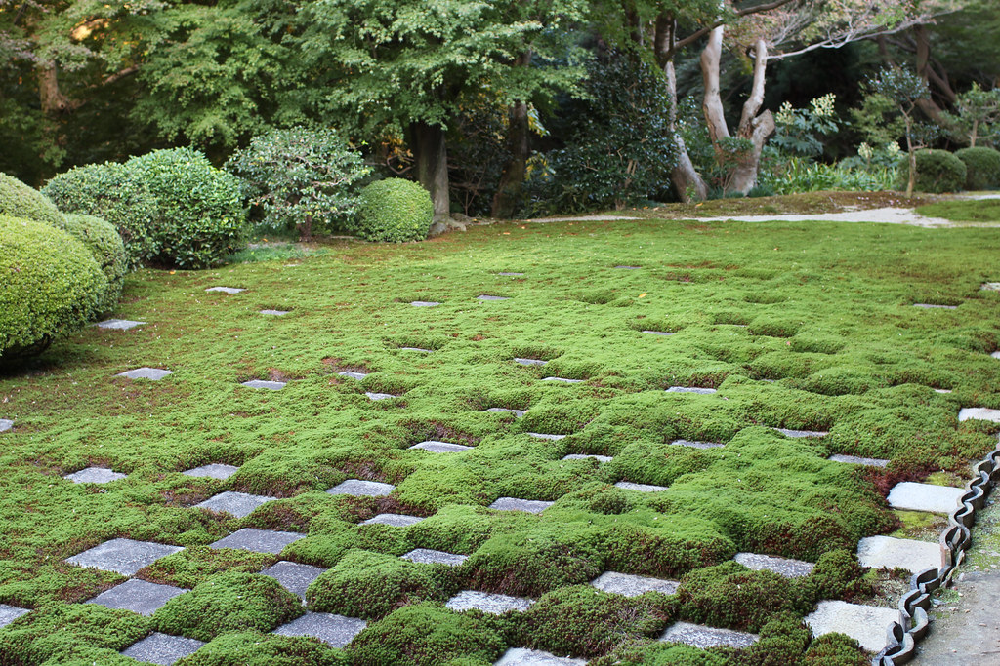
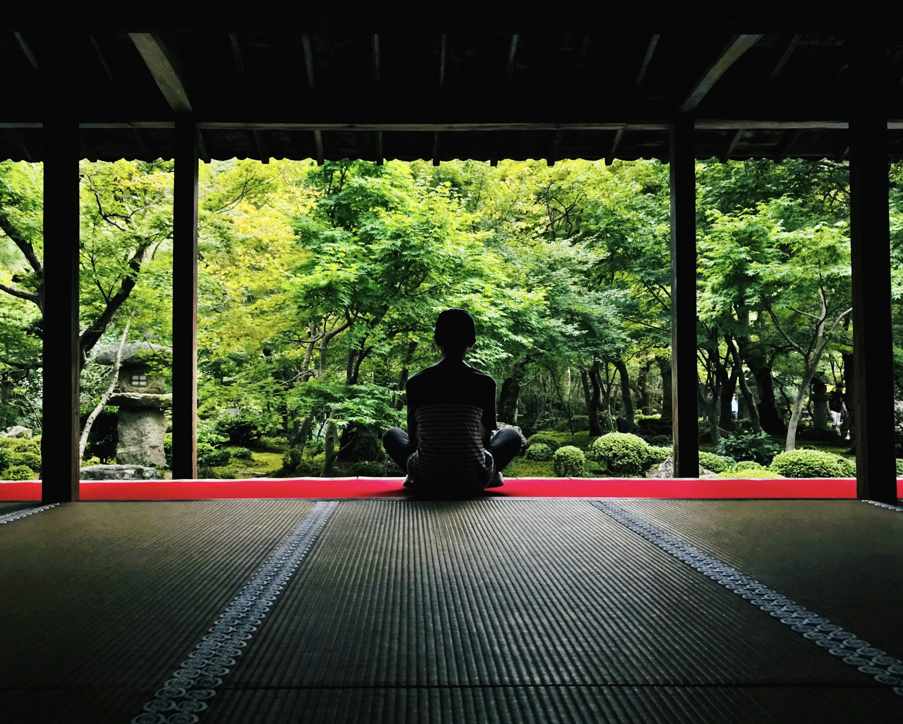

# 京都的另一面：不在清水寺，在这 3 处避世「枯山水」
#人文旅行 #美学漫游 #京都小众 #东方美学 #精神充电

<!-- pagebreak -->

很多人去京都，看的是人潮涌动的朱红与金阁。  
但我更偏爱那些隐于深巷的==枯山水庭园==——  
一勺白砂代万顷波涛，两三顽石作巍峨孤岛。

如果你想找一个地方彻底==放空、看书、听雨==，收好这 3 处私藏地图：

<!-- pagebreak -->

### 01｜龙安寺·方丈庭园
> *“15 块石头，你永远只能看见 14 块。”*

<!-- pagebreak -->

* **美学内核**：极致的留白与哲思。无论从哪个角度看，总有一块石头被遮挡，意在提醒人“==知足常乐，万事不可求全==”。
* **漫游建议**：避开上午旅行团，建议在==下午 15:30 之后入寺==。坐在木质长廊边，看斜阳拉长石头与矮墙的影子，感受纯粹的静谧。
* **坐标**：京都市右京区龙安寺御陵下町

<!-- pagebreak -->

### 02｜大德寺·大仙院
> *“从激流险滩，到澄澈大海的一生缩影。”*

<!-- pagebreak -->

* **美学内核**：把人的一生缩写进几方砂石。从源头瀑布的湍急，到平缓入海的开阔，极具==立体叙事感==。
* **漫游建议**：回廊狭窄，必须脱鞋慢行。最推荐==雨天拜访==，听雨水顺着桧皮茸屋檐滴落在苔藓上的声音，极度治愈。
* **坐标**：京都市北区紫野大德寺町

<!-- pagebreak -->

### 03｜东福寺·八相之庭
> *“昭和巨匠重森三玲的现代构图先锋。”*

<!-- pagebreak -->

* **美学内核**：市松模样的绿苔与方石棋盘格交错，打破传统枯山水的克制，充满==现代抽象几何张力==。
* **漫游建议**：秋天这里枫叶极盛，但初夏与冬日的==纯净苔藓青绿==反而最显禅意与建筑美。
* **坐标**：京都市东山区本町

<!-- pagebreak -->

### 💡 避坑与礼仪小贴士（Tips）
1. **静音模式**：寺院回廊木板传声极强，参观时请将手机调至静音，轻声交谈。
2. **着装礼仪**：大部分方丈内堂需脱鞋进入，建议穿着==深色且干净整洁的棉袜==。
3. **光线时间**：枯山水重在看阴影与砂纹层次，==早晨开门第一批==或==闭门前 1 小时==的光影质感最佳。

<!-- pagebreak -->

🌿  
**在快节奏的日常里，偶尔需要一块安静的石头。**  
你最想去哪一座庭园里发呆？评论区聊聊。
